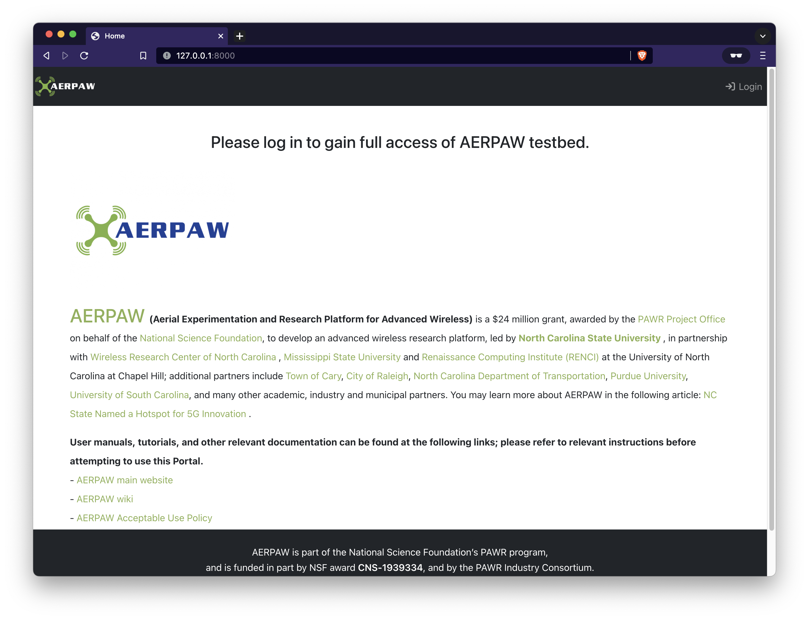

# Installation

**WORK IN PROGRESS**

The contents of this document are expected to change as the portal code evolves. Items to note

- Services currently running over HTTP on port 8000 (later version will be HTTPS on port 443 using SSL certificate)
- Django server being used to serve content (later version will be uWSGI based)
- CORS is not being enforced (enforcement TBD)

## Requirements

- Docker: [https://docs.docker.com/engine/install/](https://docs.docker.com/engine/install/)
- Docker Compose: [https://docs.docker.com/compose/install/](https://docs.docker.com/compose/install/)
- Python 3.9+: [https://www.python.org](https://www.python.org)

The Python environment illustrated in this document is deployed using `virtualenv` ([https://virtualenv.pypa.io/en/latest/](https://virtualenv.pypa.io/en/latest/)). You are welcome to use whichever environment you are most comfortable with.

## Configuration

Copy the `env.template` file as `.env`

Replace the following variables

- `DJANGO_SECRET_KEY='xxxxx'`: generate a key from [here](https://django-secret-key-generator.netlify.app)
- `OIDC_RP_CLIENT_ID='xxxxx'`: speak with RENCI to get the `client_id`
- `OIDC_RP_CLIENT_SECRET='xxxxx'`: speak with RENCI to get the `client_secret`
- `POSTGRES_PASSWORD=xxxxx`: create your own password

Ensure you are familiar with how the Postgres database host is exposed via `portal-database` or `127.0.0.1` (choose only **one**)

```bash
export POSTGRES_HOST=portal-database  # <-- Django run in Docker
export POSTGRES_HOST=127.0.0.1        # <-- Django run locally
```

### File: `.env`

```bash
# docker-compose environment file
#
# When you set the same environment variable in multiple files,
# here’s the priority used by Compose to choose which value to use:
#
#  1. Compose file
#  2. Shell environment variables
#  3. Environment file
#  4. Dockerfile
#  5. Variable is not defined

# Django settings
export PYTHONPATH=$(pwd):$(pwd)/venv:$(pwd)/.venv
export DJANGO_SECRET_KEY='xxxxx'
export DJANGO_DEBUG=True
export DJANGO_LOG_LEVEL='DEBUG'
export DJANGO_SESSION_COOKIE_AGE='3600'
export DJANGO_TIME_ZONE='America/New_York'

# Nginx configuration
export NGINX_DEFAULT_CONF=./nginx/default.conf
export NGINX_SSL_CERTS_DIR=./ssl

# OIDC CILogon - values provided when OIDC client is created
# callback url
export OIDC_RP_CALLBACK='http://127.0.0.1:8000/oidc/callback/'
# client id and client secret
export OIDC_RP_CLIENT_ID='xxxxx'
export OIDC_RP_CLIENT_SECRET='xxxxx'
# oidc scopes
export OIDC_RP_SCOPES="openid email profile org.cilogon.userinfo"
# signing algorithm
export OIDC_RP_SIGN_ALGO='RS256'
export OIDC_OP_JWKS_ENDPOINT='https://cilogon.org/oauth2/certs'
# OpenID Connect provider
export OIDC_OP_AUTHORIZATION_ENDPOINT='https://cilogon.org/authorize'
export OIDC_OP_TOKEN_ENDPOINT='https://cilogon.org/oauth2/token'
export OIDC_OP_USER_ENDPOINT='https://cilogon.org/oauth2/userinfo'
# session renewal period (in seconds)
export OIDC_RENEW_ID_TOKEN_EXPIRY_SECONDS=3600

export OIDC_STORE_ACCESS_TOKEN=true
export OIDC_STORE_ID_TOKEN=true
export OIDC_LOGOUT_URL='https://cilogon.org/logout'
export OIDC_OP_LOGOUT_URL_METHOD='main.openid.logout'

# PostgreSQL database - default values should not be used in production
export HOST_DB_DATA=./db_data
export PGDATA=/var/lib/postgresql/data
#export POSTGRES_HOST=portal-database
export POSTGRES_HOST=127.0.0.1
export POSTGRES_DB=postgres
export POSTGRES_PASSWORD=xxxxx
export POSTGRES_PORT=5432
export POSTGRES_USER=postgres

# uWSGI services in Django
export UWSGI_GID=1000
export UWSGI_UID=1000
```

## DEVELOPMENT: Local Django / Docker Database

This is the preferred way to run the portal for code development purposes.

Copy the `compose/local-docker-compose.yml` file to the main level of the repository as `docker-compose.yml`

- The `local-docker-compose.yml` file will expose port 5432 of the database container to the host for the locally running Django services to access it (never do this on public machines)

Expose the databse to the local host by updating the local `.env` file (from above) and then source it

```bash
#export POSTGRES_HOST=portal-database  # <-- Comment this out
export POSTGRES_HOST=127.0.0.1
```

Source the environment variables

```
source .env
```

Create a virtual Python environment and install the required packages (your local path to Python may vary)

```console
virtualenv -p /usr/local/bin/python3.10 venv
source venv/bin/activate
pip install -r requirements.txt
```

Pull in the Docker Postgres image

```console
docker compose pull
```

Bring up the Docker based database

```
docker compose up -d
```

Verify that the database is running

```console
$ docker compose ps
NAME                COMMAND                  SERVICE             STATUS              PORTS
portal-database     "docker-entrypoint.s…"   database            running             0.0.0.0:5432->5432/tcp, :::5432->5432/tcp
```

Execute the `run_server.sh` script to launch Django locally

```console
./run_server.sh
```

On completion you should observe the running site at: [http://127.0.0.1:8000/]()



When finished use `ctrl-c` to stop the Django server and `docker compose stop` to stop the Postgres container

If you want to reset everything back to clean us the `reset-to-clean.sh` script (stops/removes all running containers and purges all data)

```console
$ cd scripts
$ ./reset-to-clean.sh
### ALERT: stopping and removing docker containers
[+] Running 1/1
 ⠿ Container portal-database  Stopped                                                                                      0.4s
Going to remove portal-database
[+] Running 1/0
 ⠿ Container portal-database  Removed                                                                                      0.0s
### ALERT: removing migrations files
    - /Users/stealey/GitHub/aerpaw/aerpaw-portal/portal/apps/experiments/migrations
    - /Users/stealey/GitHub/aerpaw/aerpaw-portal/portal/apps/projects/migrations
    - /Users/stealey/GitHub/aerpaw/aerpaw-portal/portal/apps/resources/migrations
    - /Users/stealey/GitHub/aerpaw/aerpaw-portal/portal/apps/operations/migrations
    - /Users/stealey/GitHub/aerpaw/aerpaw-portal/portal/apps/users/migrations
    - /Users/stealey/GitHub/aerpaw/aerpaw-portal/portal/apps/profiles/migrations
### ALERT: removing volume mounts
### ALERT: replacing volume mounts
```


## DEVELOPMENT: Docker Django / Database / Nginx

This is the preferred way to run the portal if simply wanting to interact with it remotely.

Copy the `compose/public-docker-compose.yml` file to the main level of the repository as `docker-compose.yml`

- The `public-docker-compose.yml` file will only expose port 8000 of the Nginx container to the host (HTTP web traffic). All other services will use the internal Docker network (Django, Postgres, etc.)

Expose the databse to the Docker network by updating the local `.env` file (from above) and then source it

```bash
export POSTGRES_HOST=portal-database
#export POSTGRES_HOST=127.0.0.1        # <-- Comment this out
```

Source the environment variables

```
source .env
```

Pull in the Docker Postgres image

```console
docker compose pull
docker compose build
```

Bring up the Docker based containers

```
docker compose up -d
```

Verify that the database is running (it may take several minutes on first run)

- NOTE: only port 8000 is exposed to external traffic

```console
$ docker compose ps
NAME                COMMAND                  SERVICE             STATUS              PORTS
portal-database     "docker-entrypoint.s…"   database            running             5432/tcp
portal-django       "/code/docker-entryp…"   django              running
portal-nginx        "/docker-entrypoint.…"   nginx               running             0.0.0.0:8000->80/tcp, :::8000->80/tcp
```
On completion you should observe the running site at: [http://127.0.0.1:8000/]()


When finished use `docker compose stop` to stop the running containers

If you want to reset everything back to clean us the `reset-to-clean.sh` script (stops/removes all running containers and purges all data)

```console
cd scripts
./reset-to-clean.sh
```

## PRODUCTION: Docker Django / Database / Nginx

TODO
