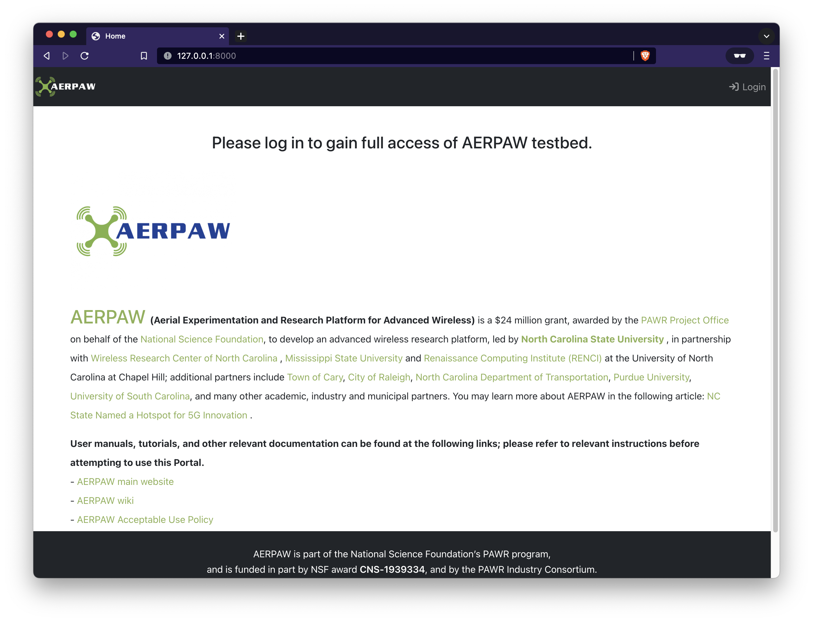
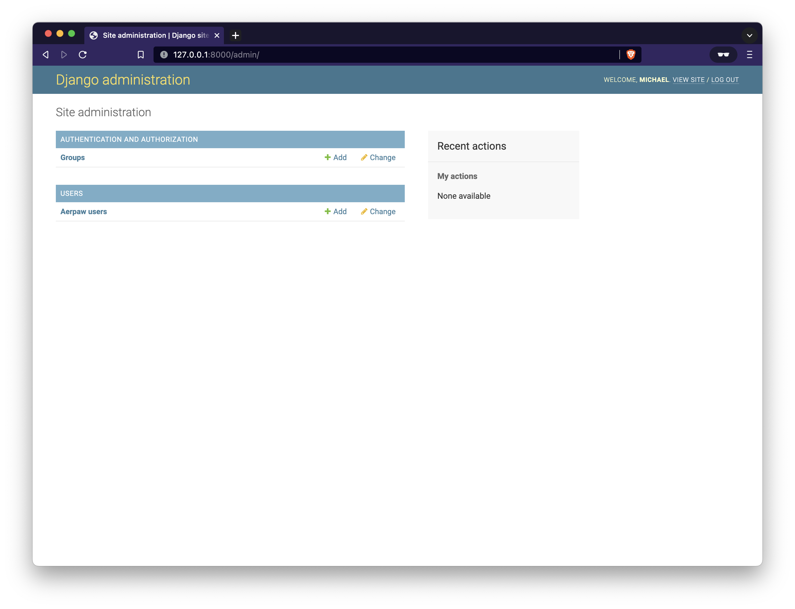

# Usage overview

## First run

The first time the portal is run it has an empty database and no concept of Users or the roles that they'll ultimately have.

Initially a user should be created that can server as the initial administrator of the system until more people are on board



Login to the portal using the "Login" button at the upper right corner (via CILogon)


After logging in for the first time the portal will present additional options to the user


### Admin rights

To provide the user with administrative rights a few manual changes can be made to the database (this is the only time a manual database change is made)

From the host that the database is running on, look for the `users_aerpawuser` table

```console
$ docker exec -u postgres portal-database psql -c "\dt;"
                         List of relations
 Schema |                  Name                  | Type  |  Owner
--------+----------------------------------------+-------+----------
...
 public | projects_userproject                   | table | postgres
 public | resources_aerpawresource               | table | postgres
 public | users_aerpawuser                       | table | postgres
 public | users_aerpawuser_groups                | table | postgres
...
```

A listing of this table will show two fields that need to be set to `True` for the user to have administrative rights within the portal

```console
$ docker exec -u postgres portal-database psql -c "select id, is_staff, is_superuser, username, email, display_name from users_aerpawuser;"
 id | is_staff | is_superuser |   username    |     email     |   display_name
----+----------+--------------+---------------+---------------+------------------
  1 | f        | f            | lnn45@nau.edu | lnn45@nau.edu | Nhat Linh Nguyen
```

Both `is_staff` and `is_superuser` need to be set to **True**

```console
$ docker exec -u postgres portal-database psql -c "update users_aerpawuser set (is_staff, is_superuser) = ('t', 't') where id = 1;"
UPDATE 1
```

Verify changes

```console
$ docker exec -u postgres portal-database psql -c "select id, is_staff, is_superuser, username, email, display_name from users_aerpawuser;"
 id | is_staff | is_superuser |   username    |     email     |   display_name
----+----------+--------------+---------------+---------------+------------------
  1 | t        | t            | lnn45@nau.edu | lnn45@nau.edu | Nhat Linh Nguyen
```

At this point the `/admin` endpoint should be available to the user



And all roles can be added to their user


Which should then be reflected on the `/profile` page of the portal


At this level of permission all API endpoints should be available to the user

## Authorization Tokens

Generate your first token pair

Pressing the "Generate New Tokens" button will create a pair of JWT tokens for the user

- `access_token` - a short lived token that provides the user authorization to the portal when communicating via ReSTful endpoints
- `refresh_token` - a longer lived token that allows the user to "refersh" their `access_token`


### Using tokens

In short tokens are used to gain access to the portal via the API. They "speak for" the user when attempting to perform an action remotely. For example, using cURL

A token can be copied and exported into a user's environment to perform actions on their behalf.

Export the `access_token` (token shortened for readability):

```console
$ export ACCESS_TOKEN='eyJ0eXAiOiJKV1QiLCJhbGciOiJIUzI1NiJ9...8EFBXr5D3W7iS5eRQtbpS2cjaNynOwxxzUqZ7EdQkas'
```

This can then be used to interact with the portal's API interface to perform various functions

Get user information:

```console
$ curl -s -X "GET" -H "Authorization: Bearer ${ACCESS_TOKEN}" -H "Accept: application/json" "http://127.0.0.1:8000/api/users" | jq .
{
  "count": 1,
  "next": null,
  "previous": null,
  "results": [
    {
      "display_name": "Nhat Linh Nguyen",
      "email": "lnn45@nau.edu",
      "user_id": 1,
      "username": "lnn45@nau.edu"
    }
  ]
}
```

Get detailed user information:

```console
$ curl -s -X "GET" -H "Authorization: Bearer ${ACCESS_TOKEN}" -H "Accept: application/json" "http://127.0.0.1:8000/api/users/1" | jq .
{
  "aerpaw_roles": [
    "experimenter",
    "pi",
    "operator",
    "site_admin"
  ],
  "display_name": "Nhat Linh Nguyen",
  "email": "lnn45@nau.edu",
  "is_active": true,
  "openid_sub": "http://cilogon.org/serverA/users/242181",
  "user_id": 1,
  "username": "lnn45@nau.edu"
}
```

Get user token information:

```console
$ curl -s -X "GET" -H "Authorization: Bearer ${ACCESS_TOKEN}" -H "Accept: application/json" "http://127.0.0.1:8000/api/users/1/tokens" | jq .
{
  "access_token": "eyJ0eXAiOiJKV1QiLCJhbGciOiJIUzI1NiJ9...8EFBXr5D3W7iS5eRQtbpS2cjaNynOwxxzUqZ7EdQkas",
  "refresh_token": "eyJ0eXAiOiJKV1QiLCJhbGciOiJIUzI1NiJ9...k9RXH_KY2g5xReq5lLO1eezX62NVAdqmZtxPiZVCg4Y"
}
```

### Tokens unfolded

Tokens are nothing magical in themselves, but rather encoded JWTs (JSON Web Tokens) that can be easily decoded using [https://jwt.io/](https://jwt.io/)

Example: `access_token`


Example: `refresh_token`


Notice in each case there is an "Invalid Signature" notation - this is because we haven't added the token **secret** to the verify signature portion of the site. In general tokens are readable by any entity that knows how they are encoded, but only **validated** by entities that posses the secret to verify the signature. This makes it relatively easy to invalidate requests that come from malevolent actors attempting to access the API.

Even if an `access_token` is somehow compromised it is relatively short lived and can also be revoked prior to it's expiry date.
